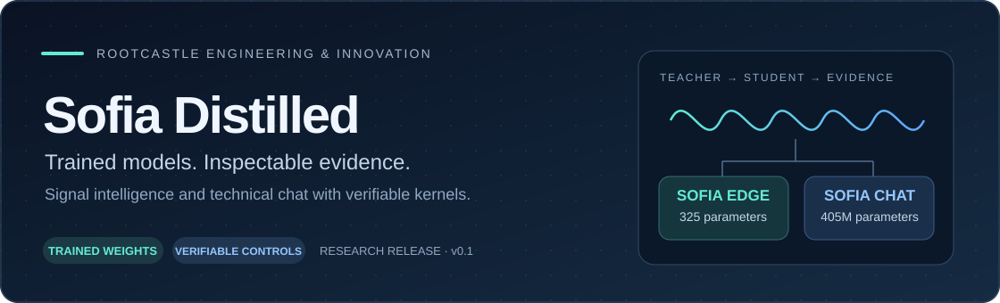
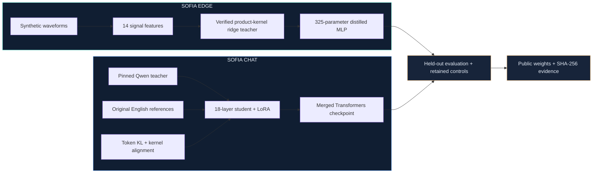

<div align="center">



# Sofia Distilled

**Machine signals and English technical chat, with trained weights and verifiable kernel controls.**

[](https://github.com/rootcastleco/sofia-distilled/actions/workflows/ci.yml) [](https://github.com/rootcastleco/sofia-distilled/releases/tag/v0.1.0) [](pyproject.toml) [](LICENSE) [](https://huggingface.co/rootcastleengineering/sofia-edge-distilled-v0.1) [](https://huggingface.co/rootcastleengineering/sofia-chat-distilled-v0.1)

[**Models**](#meet-the-models) · [**Quick start**](#quick-start) · [**Scientific method**](#the-scientific-method) · [**Results**](#measured-results) · [**Reproduce**](#reproduce-the-experiments)

Developed by **Rootcastle Engineering & Innovation** · Companion to [**Sofia Engine**](https://github.com/rootcastleco/sofia-ai)

</div>

---

## Meet the models

Sofia Distilled turns an explicit training protocol into downloadable checkpoints. It pairs a small vibration classifier with a Qwen-derived technical chat model, retaining the data, controls and measured limitations needed to inspect both.

| | **Sofia Edge** | **Sofia Chat** |
| --- | --- | --- |
| Purpose | Classify five synthetic vibration scenarios | Generate experimental English technical explanations |
| Architecture | 14 → 16 → 5 ReLU MLP | 18-layer Qwen-derived transformer |
| Parameters | **325** | **404,558,464** |
| Training | Product-kernel teacher + soft-target distillation | Teacher-token KL + reference CE + kernel alignment |
| Runtime | NumPy on CPU | Transformers on CPU or GPU |
| Checkpoint | `.npz`, approximately 2.86 kB | Merged FP16 `.safetensors`, approximately 809 MB |
| Model card | [Read Edge card](model_cards/edge.md) | [Read Chat card](model_cards/chat.md) |
| Download | [Hugging Face ↗](https://huggingface.co/rootcastleengineering/sofia-edge-distilled-v0.1) | [Hugging Face ↗](https://huggingface.co/rootcastleengineering/sofia-chat-distilled-v0.1) |

> [!IMPORTANT]
> **Research release.** Edge has no measured-machine validation. Chat generates factual errors and inherits Qwen pretraining; foundation pretraining from random initialization is not claimed. Kernel computations are classical. No quantum hardware execution or quantum computational advantage is claimed.

## From teacher to published checkpoint



These models ship in a companion package; they are not automatically registered as Sofia Engine backends. The combined CLI returns structured Edge evidence and a separately marked, unverified Chat explanation. It exposes no machinery control interface.

## Quick start

### 1. Install

Python **3.11 or later**:

```bash
git clone https://github.com/rootcastleco/sofia-distilled.git
cd sofia-distilled
python -m venv .venv
# Windows: .venv\Scripts\activate
# Linux/macOS: source .venv/bin/activate
pip install -e '.[dev,hub]'
```

For Chat, select a suitable PyTorch build using the [official installer](https://pytorch.org/get-started/locally/), then install the optional dependencies:

```bash
pip install -e '.[chat]'
```

The original Chat run used **PyTorch 2.7.1 · CUDA 11.8 · RTX 2060**. LoRA reduced optimizer memory; the selected adapter was merged into ordinary Transformers weights.

### 2. Run Edge

Edge weights are included in this repository:

```bash
# Demonstration: synthetic bearing-impulse waveform
sofia-distilled edge --demo-class 3

# Your 1-D NumPy acceleration waveform
sofia-distilled edge --signal acceleration.npy --sample-rate 2048 --shaft-hz 25
```

Training uses **1,024 samples at 2,048 Hz**, with acceleration measured in **g**. Scenarios: healthy, imbalance, misalignment, bearing impulses and rubbing. Softmax scores are uncalibrated; the range check is a feature-distance heuristic.

### 3. Run Chat

The CLI downloads the public Hugging Face checkpoint:

```bash
sofia-distilled chat --model rootcastleengineering/sofia-chat-distilled-v0.1 --prompt "Explain spectral leakage briefly."
```

<details>
<summary><strong>Use the checkpoint directly with Transformers</strong></summary>

```python
from transformers import AutoModelForCausalLM, AutoTokenizer

repo = "rootcastleengineering/sofia-chat-distilled-v0.1"
tokenizer = AutoTokenizer.from_pretrained(repo, trust_remote_code=False)
model = AutoModelForCausalLM.from_pretrained(
    repo, use_safetensors=True, trust_remote_code=False
)
messages = [
    {"role": "system", "content": "You are Sofia, a concise English technical assistant."},
    {"role": "user", "content": "Explain spectral leakage briefly."},
]
text = tokenizer.apply_chat_template(
    messages, tokenize=False, add_generation_prompt=True
)
inputs = tokenizer(text, return_tensors="pt")
output = model.generate(
    **inputs, max_new_tokens=96, do_sample=False,
    pad_token_id=tokenizer.eos_token_id,
)
print(tokenizer.decode(output[0, inputs.input_ids.shape[-1]:], skip_special_tokens=True))
```

This example uses CPU defaults. The CLI selects CUDA when available. Generated explanations require independent checking.

</details>

### 4. Combine signal evidence and explanation

```bash
hf download rootcastleengineering/sofia-chat-distilled-v0.1 --local-dir artifacts/chat
sofia-distilled assist --demo-class 3
```

The response contains `edge_evidence` and `unverified_chat_explanation`, so readers can inspect the classifier result separately from generated prose.

## The scientific method

The kernel controls follow [**Quantum Artificial Intelligence with Verifiable Kernels**](https://www.academia.edu/175377730/Quantum_Artificial_Intelligence_with_Verifiable_Kernels) by **Batuhan Ayribas (2026)**. Our independently written adaptation uses the product-rotation kernel

$$K_s(x,z)=\prod_{j=1}^{d}\cos^2\left(\frac{s(x_j-z_j)}{2}\right).$$

This expression can be evaluated efficiently on a classical computer. We audit its state-overlap and trigonometric-feature equivalents, terminal-unitary invariance, global-depolarization identity and matched centred-ridge predictions. Finite-shot SWAP simulations are evaluated separately with training-only positive-eigenspace repair.

**Edge** uses that geometry in its ridge teacher. **Chat** adapts it into a representation-alignment penalty alongside token distillation. The Chat extension is an engineering experiment; the manuscript does not prove an improvement in transformer quality or answer accuracy.

[Read the verification protocol →](docs/VERIFICATION.md)

## Measured results

### Edge · synthetic held-out classification

All four models share a balanced **1,500-example** test set.

| Model | Accuracy / balanced accuracy |
| --- | ---: |
| Product-kernel teacher | 99.933% |
| Matched-budget RBF teacher | 99.933% |
| **Distilled Edge student** | **99.933%** |
| Supervised-only student control | 100.000% |

The distilled student reaches **100.000%** on a separately generated shaft-frequency shift of **43–65 Hz**, versus **18–42 Hz** during training. These results describe simple synthetic formulas. The supervised control performs better on the main accuracy metric; no distillation quality advantage is claimed. [Full Edge measurements →](artifacts/edge-kernel/metrics.json)

### Chat · reference likelihood and compression

The released student has **18.11% fewer parameters** than its **494,032,768-parameter** teacher. Training used **6,598,656 LoRA parameters**, **640 steps**, and **192 prompts** across **48 original, AI-assisted reference topics**. Whole topic families are separated into **160 / 16 / 16** train, validation and test prompts.

| Measurement | Pruned baseline | Distilled checkpoint |
| --- | ---: | ---: |
| Validation reference perplexity ↓ | 6,635.52 | **67.96** |
| Test reference perplexity ↓ | 10,327.21 | **84.14** |
| Test product-kernel alignment MSE ↓ | 0.202223 | **0.018879** |

Teacher test reference perplexity is approximately **67.27**. Lower perplexity on this narrow bank does not establish factual correctness, coding ability or safety. Actual test generations contain errors. [Full measurements →](artifacts/chat/metrics.json) · [Inspect generated answers →](artifacts/chat/test_generations.json)

## Evidence you can inspect

| Check | Recorded result | Evidence |
| --- | --- | --- |
| Local tests at v0.1.0 | **25 passed** | [Tests](tests/) · [CI](https://github.com/rootcastleco/sofia-distilled/actions/workflows/ci.yml) |
| Independent same-environment kernel rerun | **810 arrays exactly equal** | [Reproducibility](artifacts/verification/reproducibility.json) |
| State overlap versus classical product kernel | Maximum error **1.55e-15** | [Verification report](artifacts/verification/report.json) |
| Matched exact-noise ridge predictions | Maximum error **1.37e-13** | [Verification report](artifacts/verification/report.json) |
| Public Edge downloads | **14 files** matched SHA-256 digests | [Publication audit](artifacts/publication/edge.json) |
| Public Chat downloads, including full weights | **22 files** matched SHA-256 digests | [Publication audit](artifacts/publication/chat.json) |
| Public checkpoint loading | Edge inference and Chat generation completed | [Edge result](artifacts/publication/edge_inference.json) · [Chat result](artifacts/publication/chat_inference.json) |

The experiment rerun used the same numerical environment. It does not establish bitwise identity across every platform or replace independent scientific review.

## Reproduce the experiments

```bash
# For CPU reproducibility, set OPENBLAS_NUM_THREADS=1 and OMP_NUM_THREADS=1.
python -m sofia_distilled.kernel_training --output artifacts/edge-kernel --epochs 120
python -m sofia_distilled.chat_training --output artifacts/chat --layers 18 --epochs 4
python -m sofia_distilled.verification --output reproduced-verification --replicates 30
pytest -q
```

`verification` refuses to overwrite a completed report. Training retains original references, targets and compatible cache configuration. Qwen teacher revision: `7ae557604adf67be50417f59c2c2f167def9a775`.

<details>
<summary><strong>Stage, publish and audit a checkpoint</strong></summary>

```bash
python scripts/publish.py edge
python scripts/publish.py chat
# After a local `hf auth login`:
python scripts/publish.py edge --upload
python scripts/publish.py chat --upload
python scripts/verify_publication.py edge
python scripts/verify_publication.py chat --download-weights
```

The staging script requires completed outputs and selects named files. Upload a completed, unchanged staging directory. Final weights use NumPy `.npz` or `.safetensors`.

</details>

## Project map

| Path | What is inside |
| --- | --- |
| [`src/sofia_distilled/`](src/sofia_distilled/) | Kernel controls, training and inference CLI |
| [`model_cards/`](model_cards/) | English scope, provenance and model limitations |
| [`docs/VERIFICATION.md`](docs/VERIFICATION.md) | Scientific protocol and exact claim boundaries |
| [`artifacts/edge-kernel/`](artifacts/edge-kernel/) | Edge weights, synthetic data, teacher and control |
| [`artifacts/chat/`](artifacts/chat/) | Chat configuration, references and measured results |
| [`artifacts/verification/`](artifacts/verification/) | Retained kernel experiments and rerun evidence |
| [`artifacts/publication/`](artifacts/publication/) | Public download and inference audits |
| [`scripts/`](scripts/) | Checkpoint finalization, staging and verification |

## License and attribution

**Apache-2.0.** See [LICENSE](LICENSE) and [NOTICE](NOTICE). Qwen weight and tokenizer attribution is retained. The manuscript informs the controls; model quality claims are limited to the reported experiments.

---

<div align="center">

**Rootcastle Engineering & Innovation**

[Sofia Engine](https://github.com/rootcastleco/sofia-ai) · [Release v0.1.0](https://github.com/rootcastleco/sofia-distilled/releases/tag/v0.1.0) · [Edge checkpoint](https://huggingface.co/rootcastleengineering/sofia-edge-distilled-v0.1) · [Chat checkpoint](https://huggingface.co/rootcastleengineering/sofia-chat-distilled-v0.1)

</div>
